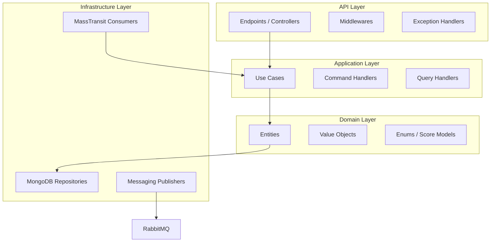
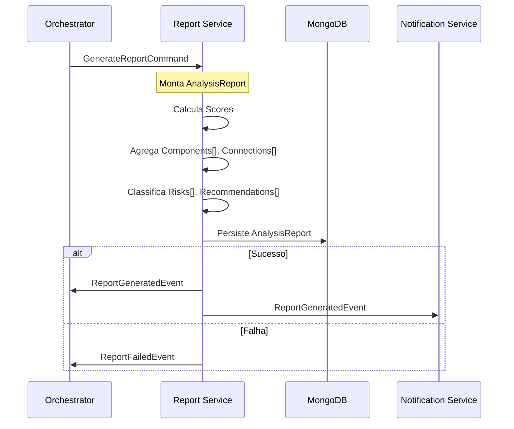
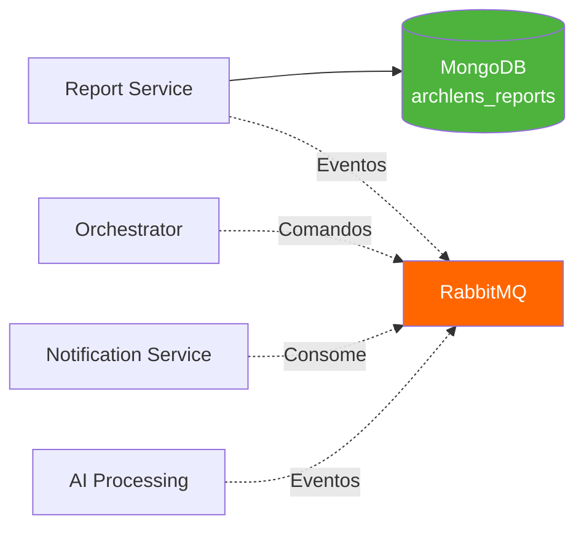
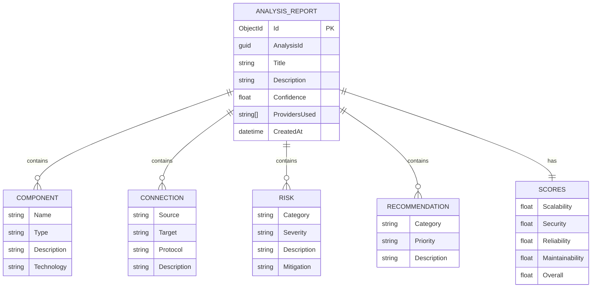
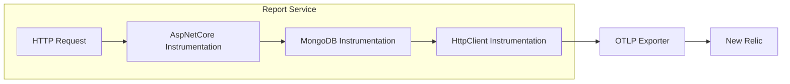

# ArchLens - Report Service

[](https://github.com/ArchLens-Fiap/archlens-report-service/actions/workflows/ci.yml) [](https://sonarcloud.io/dashboard?id=ArchLens-Fiap_archlens-report-service) [](https://sonarcloud.io/dashboard?id=ArchLens-Fiap_archlens-report-service)

> **Microsserviço de Geração e Gestão de Relatórios de Análise Arquitetural**
> Hackathon FIAP - Fase 5 | Pós-Tech Software Architecture + IA para Devs
>
> **Autor:** Rafael Henrique Barbosa Pereira (RM366243)

[](https://dotnet.microsoft.com/)
[](https://www.docker.com/)
[](https://blog.cleancoder.com/uncle-bob/2012/08/13/the-clean-architecture.html)
[](https://www.mongodb.com/)
[](https://www.rabbitmq.com/)

## 📋 Descrição

O **Report Service** é o microsserviço responsável pela geração, persistência e consulta de relatórios de análise arquitetural. Recebe comandos via RabbitMQ para gerar relatórios a partir dos resultados produzidos pelo AI Processing, armazenando **componentes**, **conexões**, **riscos**, **recomendações** e **scores** de qualidade (escalabilidade, segurança, confiabilidade, manutenibilidade e nota geral) em MongoDB. Também expõe métricas administrativas para dashboards.

## 🏗️ Arquitetura

O projeto segue os princípios de **Clean Architecture**:



## 🔄 Fluxo de Eventos - Pipeline de Relatórios

O Report Service é acionado via evento após a conclusão do processamento de IA:



## 🛠️ Tecnologias

| Tecnologia | Versão | Descrição |
|------------|--------|-----------|
| .NET | 9.0 | Framework principal |
| MongoDB.Driver | 2.x | Driver para MongoDB |
| MongoDB | 7+ | Banco de dados NoSQL |
| MediatR | 12.x | Padrão Mediator (CQRS) |
| FluentValidation | 11.x | Validação de DTOs |
| MassTransit | 8.x | Abstração de Message Broker |
| RabbitMQ | 3.x | Message Broker |
| Serilog | 4.x | Logging estruturado |
| OpenTelemetry | 1.x | Traces e métricas distribuídas |

## 🔒 Isolamento de Banco de Dados

> ⚠️ **Requisito:** "Nenhum serviço pode acessar diretamente o banco de outro serviço."

Este serviço acessa **exclusivamente** seu próprio banco MongoDB (`archlens_reports`). A comunicação com outros serviços (Orchestrator, Notification) é feita **apenas via RabbitMQ (eventos)**:



**Eventos publicados:** `ReportGeneratedEvent`, `ReportFailedEvent`
**Eventos consumidos:** `GenerateReportCommand`

## 📁 Estrutura do Projeto

```
archlens-report-service/
├── src/
│   ├── ArchLens.Report.Api/                # API Layer
│   │   ├── Endpoints/                      # Minimal APIs
│   │   │   ├── Reports/                    # CRUD de relatórios
│   │   │   └── Admin/                      # Métricas administrativas
│   │   └── Program.cs                      # Entry point
│   │
│   ├── ArchLens.Report.Application/        # Application Layer
│   │   ├── Commands/                       # GenerateReport handler
│   │   └── Queries/                        # GetById, GetByAnalysis, List
│   │
│   ├── ArchLens.Report.Domain/             # Domain Layer
│   │   ├── Entities/                       # AnalysisReport
│   │   ├── ValueObjects/                   # Score, Component, Connection, Risk
│   │   └── Interfaces/                     # Contratos de repositórios
│   │
│   └── ArchLens.Report.Infrastructure/     # Infrastructure Layer
│       ├── Persistence/MongoDB/            # Repositories MongoDB
│       └── Messaging/                      # Consumers e Publishers
│
└── tests/
    └── ArchLens.Report.Tests/              # Testes unitários e integração
```

## 🚀 Como Executar

### Opção 1: Docker Compose (Recomendado) ✨

Clone o repositório [archlens-docs](https://github.com/ArchLens-Fiap/archlens-docs) e execute:

```bash
docker-compose up -d
```

### Opção 2: Manual

#### Pré-requisitos
- .NET 9.0 SDK
- Docker (para MongoDB e RabbitMQ)

#### Passos

```bash
# 1. Subir infraestrutura
docker-compose -f docker-compose.infra.yml up -d

# 2. Executar a API
dotnet run --project src/ArchLens.Report.Api
```

A API estará disponível em: `http://localhost:5205`

## 📡 Endpoints

### Relatórios (`/reports`)

| Método | Endpoint | Descrição |
|--------|----------|-----------|
| GET | `/reports/{id}` | Buscar relatório por ID |
| GET | `/reports/analysis/{analysisId}` | Buscar relatório por ID da análise |
| GET | `/reports` | Listar relatórios (paginado) |
| GET | `/reports/admin/metrics` | Métricas administrativas |

### Admin Metrics

O endpoint `/reports/admin/metrics` retorna:

| Métrica | Descrição |
|---------|-----------|
| Total de relatórios | Contagem geral de reports gerados |
| Score médio (overall) | Média de scores de todas as análises |
| Uso por provider | Distribuição de uso dos providers de IA |
| Médias por categoria | Scores médios de scalability, security, reliability, maintainability |

## 📊 Modelo de Dados - AnalysisReport



## 📨 Eventos

### Eventos Consumidos

| Evento | Ação |
|--------|------|
| `GenerateReportCommand` | Gera relatório completo a partir dos dados da análise |

### Eventos Publicados

| Evento | Quando |
|--------|--------|
| `ReportGeneratedEvent` | Relatório gerado com sucesso |
| `ReportFailedEvent` | Falha na geração do relatório |

## 🧪 Testes

```bash
# Rodar todos os testes
dotnet test

# Rodar com cobertura
dotnet test --collect:"XPlat Code Coverage" --settings coverlet.runsettings

# Testes de integração (requer Docker)
dotnet test --filter "Category=Integration"
```

## 🔧 Configuração

### Variáveis de Ambiente

| Variável | Descrição |
|----------|-----------|
| `MongoDB__ConnectionString` | String de conexão MongoDB |
| `MongoDB__DatabaseName` | Nome do banco (`archlens_reports`) |
| `RabbitMQ__Host` | Host do RabbitMQ |
| `RabbitMQ__Username` | Usuário do RabbitMQ |
| `RabbitMQ__Password` | Senha do RabbitMQ |
| `NEW_RELIC_LICENSE_KEY` | Chave de licença do New Relic |

## 🐳 Docker

```bash
docker build -t archlens-report-service .
docker run -p 5205:8080 archlens-report-service
```

## 📈 Health Checks

```
GET /health          # Health check geral
GET /health/ready    # Readiness (MongoDB + RabbitMQ)
GET /health/live     # Liveness
```

## 📊 Observabilidade

O serviço possui integração completa com **OpenTelemetry** e **Serilog** para observabilidade:

### OpenTelemetry (Traces + Metrics)



**Instrumentações:**
- `AspNetCore` - Traces de requisições HTTP
- `MongoDB` - Traces de operações no banco
- `HttpClient` - Traces de chamadas externas

**Métricas:**
- Runtime (.NET metrics)
- Process (CPU, Memory)
- ASP.NET Core (requests, latência)

### Serilog (Logs Estruturados)

```json
{
  "Timestamp": "2026-03-15T00:00:00Z",
  "Level": "Information",
  "MessageTemplate": "Report {ReportId} generated for analysis {AnalysisId}",
  "Properties": {
    "ReportId": "guid-456",
    "AnalysisId": "guid-123",
    "OverallScore": 7.8,
    "ProvidersUsed": ["openai-gpt4o", "gemini-2.0-flash"],
    "CorrelationId": "abc-123",
    "ServiceName": "report-service"
  }
}
```

---

FIAP - Pós-Tech Software Architecture + IA para Devs | Fase 5 - Hackathon (12SOAT + 6IADT)
